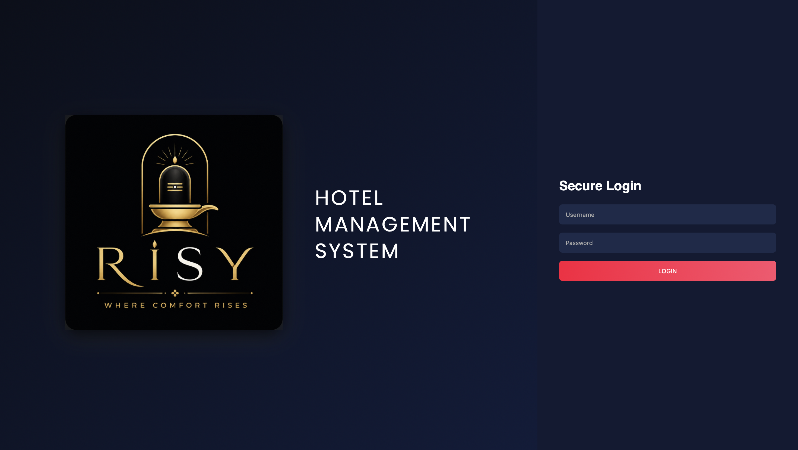
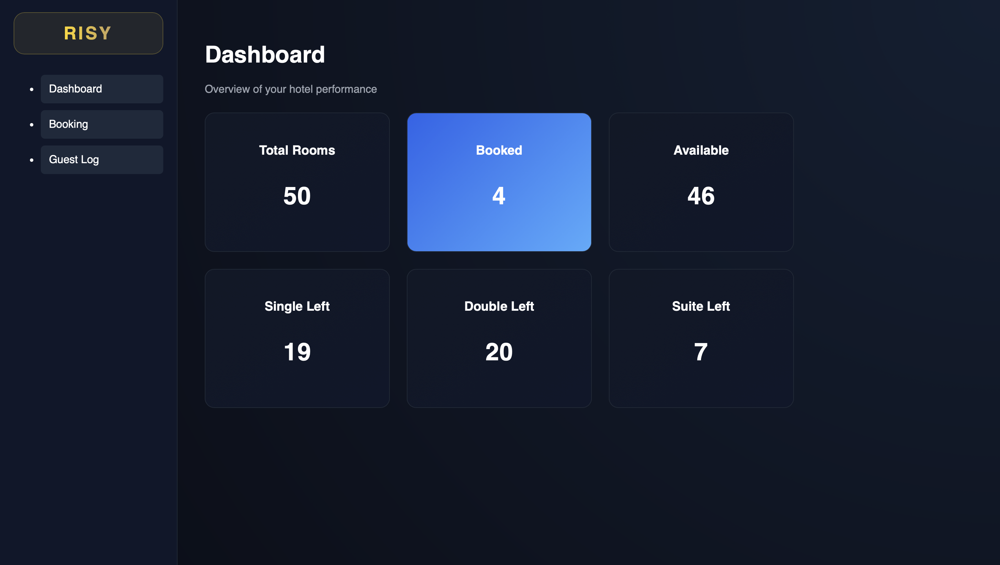
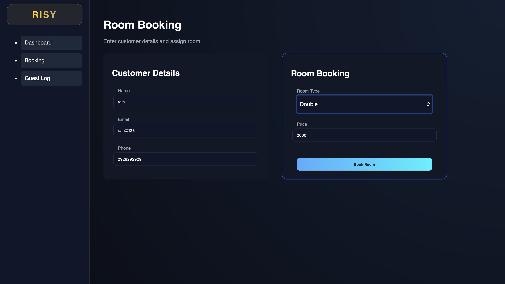
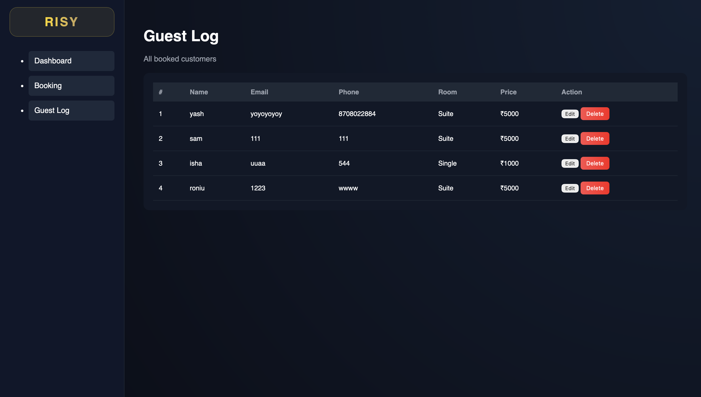

# 🏨 RISY Hotel Management System  

RISY – Where Comfort Rises

A modern Hotel Management System with real-time booking, live dashboard, and a premium UI.

---

## 🚀 Features

- 🛏️ Room Booking System  
- ✏️ Edit & Delete Bookings  
- 📊 Live Dashboard  
- 🧮 Room-wise Availability (Single / Double / Suite)  
- 🔄 Supabase Database Integration  
- 🎨 Clean Dark UI  

---

## 📸 Screenshots

### 🔐 Login Page  

Secure login interface with premium RISY branding.

---

### 📊 Dashboard  

Displays total rooms, booked rooms, available rooms, and room-type availability.

---

### 🛏️ Booking Page  

Allows entering customer details and booking rooms dynamically with pricing.

---

### 📋 Guest Log  

Shows all bookings with edit and delete functionality.

---

## 🛠️ Tech Stack

- Frontend: HTML, CSS, JavaScript  
- Backend: Supabase  
- Database: PostgreSQL  

---

## 🗄️ Database Schema

sql CREATE EXTENSION IF NOT EXISTS "uuid-ossp";  CREATE TABLE bookings (   id UUID PRIMARY KEY DEFAULT uuid_generate_v4(),   name TEXT NOT NULL,   email TEXT NOT NULL,   phone TEXT NOT NULL,   room_type TEXT NOT NULL,   price INT NOT NULL,   created_at TIMESTAMP DEFAULT CURRENT_TIMESTAMP ); 

---

## 📂 Project Structure

RISY-Hotel-Management-System/ │── index.html │── style.css │── script.js │── risy_logo.png │── screenshots/

---

## ⚙️ How to Run

bash git clone https://github.com/YOUR_USERNAME/RISY-Hotel-Management-System.git cd RISY-Hotel-Management-System 

Open index.html in browser.

---

## 🔑 Supabase Setup

js const supabaseClient = supabase.createClient(   "YOUR_PROJECT_URL",   "YOUR_PUBLISHABLE_KEY" ); 

---

## 👨‍💻 Author

Swayam Arora  
Ishu
Ronit Sharma 
Yash Chaudhary
B.Tech CSE (AIML)

